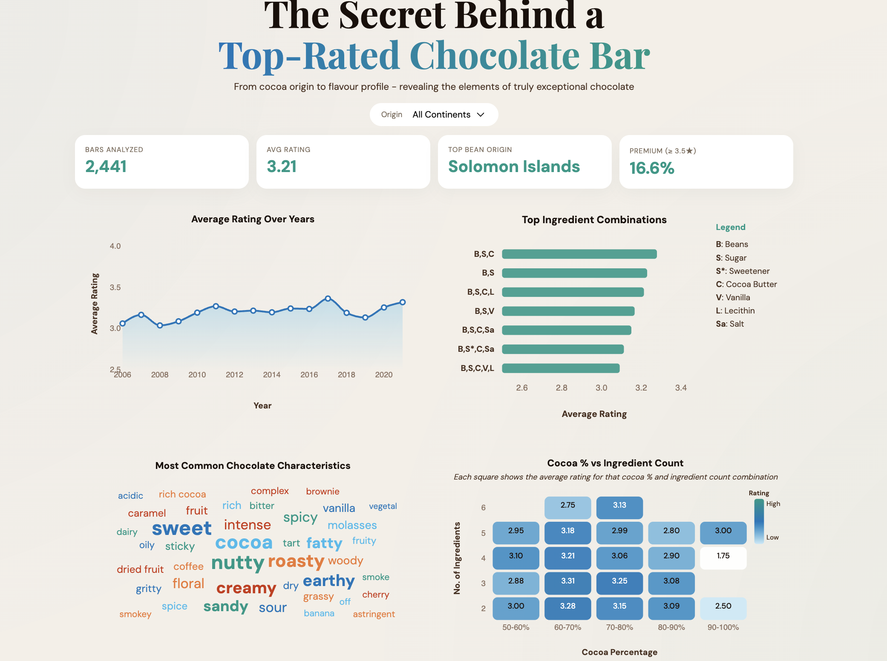

# Chocolate Rating Dashboard 🍫

**The Secret Behind a Top-Rated Chocolate Bar** is an interactive data visualisation dashboard exploring how cocoa origin, ingredients, cocoa percentage and flavour characteristics relate to chocolate ratings.

[**View the Live Interactive Dashboard**](https://areebak01.github.io/Data-Science-Portfolio/data-visualization/chocolate-rating-dashboard/)



## Dashboard Features

- **Origin filter:** Explore chocolate ratings by continent.
- **Summary metrics:** View the number of chocolate bars analysed, average rating, top bean origin and percentage of premium-rated bars.
- **Ratings over time:** Examine changes in average chocolate ratings across years.
- **Ingredient combinations:** Compare the average ratings of commonly used ingredient combinations.
- **Flavour characteristics:** Explore frequently occurring flavour descriptions through a word cloud.
- **Cocoa percentage and ingredient count:** Use an interactive heatmap to compare average ratings across different combinations.

## Tools and Technologies

- **HTML and CSS** — dashboard structure and styling
- **JavaScript** — interactive visualisations and filtering
- **CSV** — prepared chocolate rating datasets

## Run Locally

1. Download or clone this repository.
2. Open a terminal in the `chocolate-rating-dashboard` folder.
3. Start a local server:

   ```bash
   python3 -m http.server 8000
   ```

4. Open [http://localhost:8000](http://localhost:8000) in your browser.

The dashboard loads the CSV files from the project folder, so keep them alongside `index.html`, `script.js` and `style.css`.
