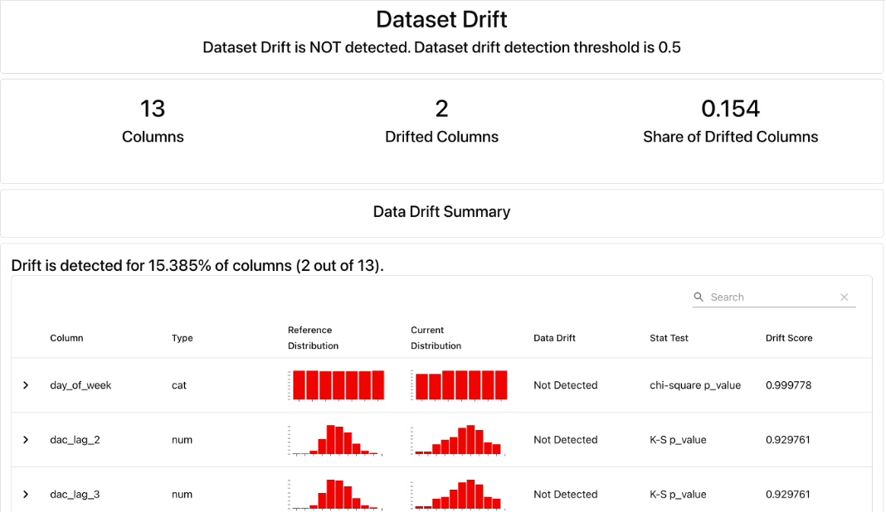

# Daily Active Customer Forecasting

An end-to-end machine learning project for forecasting daily active banking customers, covering model development, experiment tracking, containerisation, batch inference, CI, performance monitoring, drift detection and public deployment.

🌐 **[Live Streamlit Dashboard](https://daily-active-customer-forecast.streamlit.app/)**

## Project Overview

This project uses a synthetic banking dataset containing approximately one million transactions across 60,000 customers in 2023. The objective is to forecast the number of unique customers who will make at least one transaction the following day.

The project began as a forecasting analysis comparing statistical baselines with XGBoost and was subsequently developed into a reproducible end-to-end machine learning workflow.

The implementation covers:

- Time-series feature engineering
- Baseline and XGBoost model comparison
- Chronological model evaluation
- Automated testing
- MLflow experiment tracking and model versioning
- Docker containerisation
- Scheduled-style batch inference
- Prediction storage
- Model performance monitoring
- Feature drift detection with Evidently
- Continuous integration with GitHub Actions
- Streamlit dashboard and public deployment

## Model Development

The forecasting model uses historical customer activity, transaction volume and calendar information to generate one-day-ahead forecasts.

Features include:

- Customer activity lags: 1, 2, 3, 7 and 14 days
- 7-day and 14-day rolling statistics
- Lagged transaction volume
- Day of week
- Month

Feature generation is designed to avoid target leakage by ensuring that forecasting features only use information available before the prediction date.

The final XGBoost model was trained using a chronological split, with January to October used for training and November to December retained as an independent test period.

## Model Comparison

| Model | Test MAE (customers) |
| --- | ---: |
| Historical expanding mean | 42.45 |
| Seven-day moving average | 43.10 |
| XGBoost (tuned) | 43.63 |
| Naïve forecast | 58.85 |

Although XGBoost marginally outperformed the expanding mean during validation, this improvement did not persist on the independent test period. The simpler expanding-mean baseline achieved the lowest test MAE.

This demonstrates the importance of benchmarking machine learning models against simple statistical approaches rather than assuming that greater model complexity will produce better forecasts.

The reproducible production-style XGBoost pipeline currently achieves approximately:

- **MAE:** 43.69 customers
- **RMSE:** 55.08 customers

The small difference from the original notebook result is associated with recreating the model in the standalone pipeline environment.

## ML Engineering Workflow

The project extends the modelling work into a reproducible ML lifecycle:

```text
Historical Transaction Data
          ↓
Data Preparation
          ↓
Feature Engineering
          ↓
Model Training & Evaluation
          ↓
        MLflow
   Experiment Tracking
    & Model Registry
          ↓
     Saved Model
          ↓
        Docker
          ↓
    Batch Inference
          ↓
   Stored Forecasts
       ↙       ↘
Performance     Streamlit
Monitoring      Dashboard
     ↓
Evidently Drift Monitoring
```

### Experiment Tracking and Model Versioning

MLflow is used to record:

- Model hyperparameters
- MAE and RMSE
- Model artifacts
- Model signature
- Input examples

The selected XGBoost model is also registered in the MLflow Model Registry, providing a foundation for controlled model versioning and future retraining workflows.

### Containerisation

The inference workflow is containerised with Docker to provide a reproducible runtime environment.

The Docker image packages the application code, dependencies, model and required data so batch forecasts can be generated consistently across environments.

### Batch Inference

The model supports one-day-ahead batch forecasting using an `as-of` date.

For example:

```bash
python src/batch_inference.py --as-of-date 2023-12-15
```

The pipeline uses only information available up to the specified date and stores generated forecasts in:

```text
predictions/forecasts.csv
```

This simulates how a daily forecasting workflow could operate when new transaction data becomes available.

## Model Monitoring

Two forms of post-inference monitoring are implemented.

### Performance Monitoring

Saved forecasts are joined with subsequently available actual customer activity to calculate forecast errors.

The monitoring pipeline records:

- Predicted active customers
- Actual active customers
- Absolute error
- Monitoring MAE

The included monitoring sample currently contains two simulated production forecasts, so its monitoring MAE should not be interpreted as evidence that the model performs better than the larger held-out test evaluation.

### Data Drift Monitoring

Evidently is used to compare model feature distributions between the training reference period and the later simulated production period.

Feature-level drift was detected in **2 of 13 features (15.4%)**: `month` and `dac_rolling_mean_14`. This remained below Evidently's 50% dataset-level threshold, so the dataset overall was not classified as drifted.



Drift is treated as a monitoring signal for investigation rather than an automatic trigger for model replacement.

## Automated Testing and CI

Automated tests with `pytest` validate important feature-engineering behaviour, including:

- Correct historical lag generation
- Leakage-safe rolling statistics
- Feature creation for future inference dates

GitHub Actions runs the CI workflow automatically on pushes and pull requests to `main`.

The workflow:

1. Sets up Python
2. Installs project dependencies
3. Runs the automated test suite
4. Builds the Docker image

This provides automated validation that both the Python pipeline and containerised application remain buildable after code changes.

## Streamlit Dashboard

The project includes a publicly deployed Streamlit dashboard presenting:

- Historical daily customer activity
- Latest batch forecast
- Recent forecasts
- Held-out model performance
- Forecast monitoring results
- Feature drift indicators

🌐 **[Open the Live Dashboard](https://daily-active-customer-forecast.streamlit.app/)**

## Project Structure

```text
daily-active-customer-forecasting/
├── data/
│   └── daily_activity.csv
├── models/
│   └── xgboost_model.joblib
├── monitoring/
│   ├── data_drift_report.html
│   └── performance.csv
├── predictions/
│   └── forecasts.csv
├── src/
│   ├── batch_inference.py
│   ├── config.py
│   ├── drift.py
│   ├── evaluate.py
│   ├── features.py
│   ├── monitor.py
│   ├── predict.py
│   └── train.py
├── tests/
│   └── test_features.py
├── app.py
├── daily_active_customer_forecasting.ipynb
├── Dockerfile
├── requirements.txt
└── README.md
```

The repository also contains a GitHub Actions workflow under `.github/workflows/ml-ci.yml`.

## Technologies

**Machine Learning & Data**

Python, Pandas, NumPy, Scikit-learn, XGBoost

**MLOps & Engineering**

MLflow, Docker, pytest, GitHub Actions, Evidently

**Application & Deployment**

Streamlit, Streamlit Community Cloud

**Techniques**

Time-series feature engineering, chronological splitting, time-series cross-validation, baseline benchmarking, hyperparameter tuning, batch inference, experiment tracking, model versioning, performance monitoring and feature drift detection.

## Dataset

The project uses the [Synthetic Global Bank Transactions Dataset - Kaggle](https://www.kaggle.com/datasets/mckenziemakwela/synthetic-global-bank-transactions-dataset).

The original dataset contains approximately one million transaction records. It is not stored in this repository.

The modelling notebook demonstrates the original preprocessing workflow. For the operational ML pipeline, the processed daily dataset contains **365 observations** covering **1 January 2023 to 31 December 2023**, allowing the deployment workflow to remain lightweight while preserving the same forecasting logic.

## Notebook

The original analysis is available in:

[`daily_active_customer_forecasting.ipynb`](daily_active_customer_forecasting.ipynb)

It contains the exploratory analysis, baseline forecasting, feature engineering, model development, hyperparameter tuning and final evaluation that formed the basis of the production-style pipeline.

## Limitations

This is a portfolio implementation using a static historical dataset rather than a live banking data source.

Production behaviour is therefore simulated by treating later historical observations as newly arriving data. Batch inference, performance monitoring and drift detection demonstrate how the workflow would operate in a production setting, but the application should not be interpreted as a live banking forecasting system.

The current monitoring sample is intentionally small, and automated retraining and model promotion are potential future extensions.
